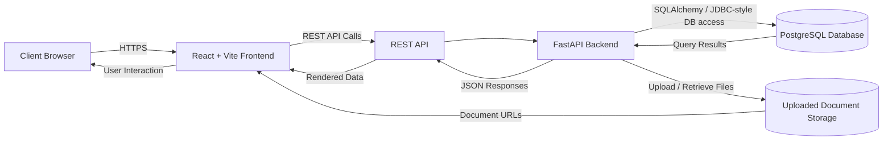

# SuwaSawiya Deployment Diagram

## Notes

- The browser accesses the React + Vite frontend.
- The frontend communicates with the backend through REST API requests.
- FastAPI handles application logic and persists data in PostgreSQL through SQLAlchemy.
- Uploaded medical documents are stored in file storage and referenced by the backend.