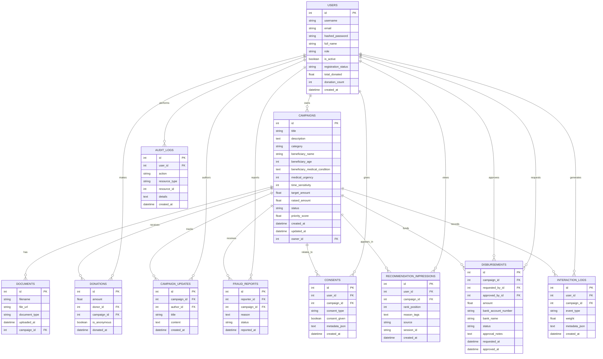

# SuwaSawiya Entity Relationship Diagram

## Notes

- `USERS` and `CAMPAIGNS` are the two core tables that anchor most relationships.
- `DISBURSEMENTS` references `USERS` twice: once for the requester and once for the approver.
- `CONSENTS` and `AUDIT_LOGS` are separate tracking tables used for compliance and traceability.
- `INTERACTION_LOGS` and `RECOMMENDATION_IMPRESSIONS` support the recommendation and analytics features.