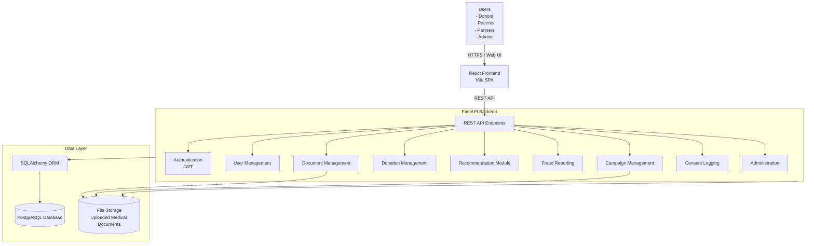

# SuwaSawiya System Architecture

## Notes

- The React frontend is a Vite single-page application that talks to the backend over REST.
- FastAPI exposes the application modules shown above and uses JWT for authenticated requests.
- SQLAlchemy mediates access to PostgreSQL.
- Uploaded medical documents are stored on file storage managed by the backend and served through the upload/static file path.