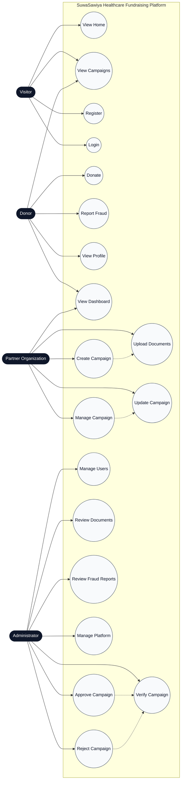

# SuwaSawiya Use Case Diagram

## Notes

- The diagram reflects the core product flows exposed by the React frontend and FastAPI backend.
- Administrative actions map to the protected backend routes used for approval, review, and platform governance.
- Partner campaign operations align with campaign creation, document upload, and update endpoints.